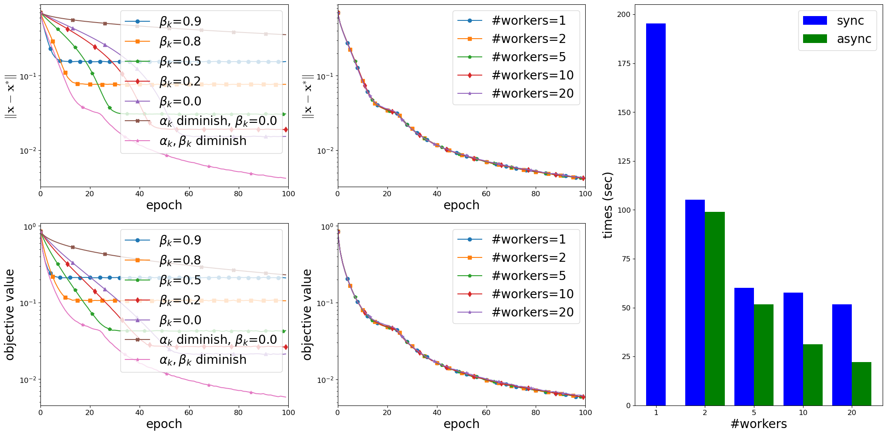
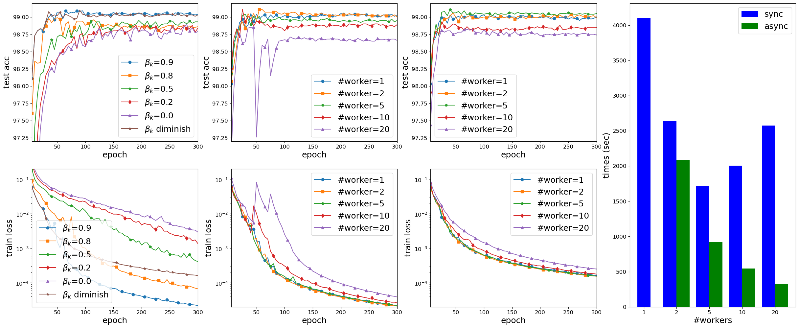
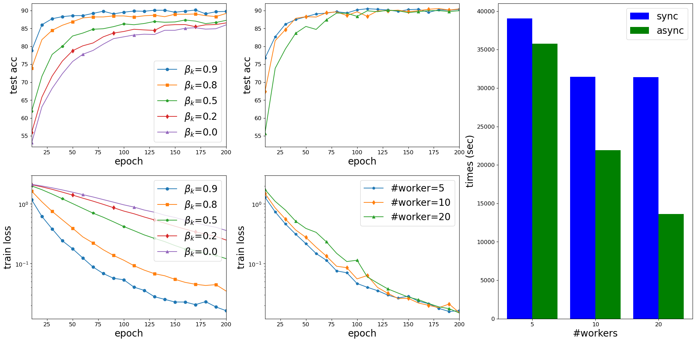
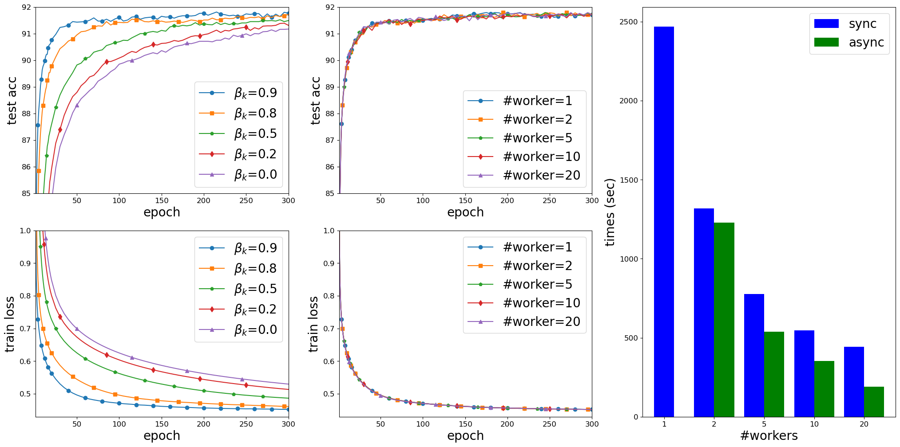

# Inertial-SsGM

This repository is the implementations of the paper: Distributed stochastic inertial methods with delayed derivatives [(Xu et al. 2021)](#xu2021distributed).

<!-- ## Table of Contents
- [Security](#security)
- [Background](#background)
- [Install](#install) 
 -->

## Requirements

Our implementations are in Python 3.8.5 installed under Miniconda. 
Our implementations rely on Pytorch and MPI4PY installed via conda install.

## Content

In the paper, we included 3 examples: phase retrieval problem, neural network models training, and sparse bilinear logistic regression.
Four folders in this repository are corresponding to the three examples (two folders for the neural network models training). 
Each of these four folders includes: 
> - example.py, which is the main code for that example;
> - run_example.sh, which runs the main code with different parameters and stores the results in the subfolder "results";
> - results, which is a folder incuding the results of the example; 
> - plot_example.py, whihc plots the figures in the paper from the results;
> - example.png, which is plotted by plot_example.py.

Here "example" represents any general example name.

Besides the four folders, the repository includes:
> - data, which is a folder including the datasets;
> - run_all.sh, which runs all run_example.sh in the above fours folers.

## Usage

- Run run_all.sh to produce the results in the paper. 
- Or in the example folder, run run_example.sh to produce the results of that example.
- Or run the main code of each example with parameters as the way in run_example.sh.

## Performance

On Ubuntu Linux 16.04, Dual Intel Xeon Gold 6130 3.7GHz, 32 CPU cores. 

### Phase Retrieval Problem   
<!--  -->

Results on solving instances of the Phase Retrieval Problem with random $\vx^*$, $m=50,000$ and $d=20,000$. 
Left: non-parallel implementation with different choices of $\{\alpha_k\}$ and $\{\beta_k\}$;  
Middle: async-parallel implementation with diminishing $\{\alpha_k\}$ and $\{\beta_k\}$, and with different numbers of workers; 
Right: running time (in second) of the sync-parallel and async-parallel implementation with different numbers of workers.  

### Neural network models training - LeNet5 on MNIST
<!--  -->

Results on training LeNet5 on the MNIST dataset. 
First column: non-parallel implementation with $\alpha_k=0.001,\forall\, k$ and different choices of $\{\beta_k\}$; Second column:  async-parallel implementation of 
with $\alpha_k=0.001$ and $\beta_k=0.9,\forall\, k$; Third column: async-parallel implementation with $\alpha_k=0.001$ and $\beta_k=\min\big\{0.9, \frac{2}{ (e_k+1)^{1/4}} \big\},\forall\, k$; Fourth column: running time (in second) of the sync-parallel and async-parallel implementations with different numbers of workers.

### Neural network models training - AllCNN on Cifar10 

Results on training AllCNN on  the Cifar10 dataset.
Left: non-parallel implementation with $\alpha_k=0.005$ and different $\{\beta_k\}$; 
Middle: async-parallel implementation with $\alpha_k=0.005, \beta_k=0.9$, and with different numbers of workers;
Right: running time (in second) of the sync-parallel and async-parallel implementations with different numbers of workers.

### Sparse bilinear logistic regression

Results to solve the sparse bilinear logistic regression on the MNIST dataset with $p=5$ and $\lambda=0.001$.  
Left: non-parallel implementation with $\alpha_k=0.0005$ and different $\{\beta_k\}$;
Middle: async-parallel implementation with $\alpha_k=0.0005, \beta_k=0.9,\forall\, k$, and with different numbers of workers;
Right: running time (in second) of the sync-parallel and async-parallel implementations with different numbers of workers.

## Reference  

- Yangyang Xu, Yibo Xu, Yonggui Yan, and Jie Chen. [Distributed stochastic inertial methods with delayed derivatives](https://arxiv.org/abs/2107.11513). Preprint arXiv:2107.11513, 2021.
